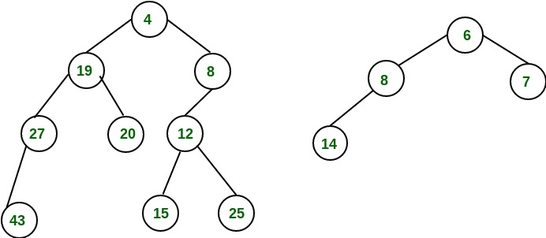

# Prelab10
1. How does heapsort work? Explain your answer and then use pseudocode to illustrate the
solution.

Heap sort is a comparison-based sorting algorithm that uses the properties of a binary heap to sort an array in ascending order. The algorithm builds a heap from the input array, then repeatedly extracts the maximum element from the heap and places it at the end of the array until the heap is empty. Finally, the sorted array is obtained by reversing the order of the elements at the end of the array.
The process followed by the heapsort is the following:
Build a heap from the given array.
Repeat the following steps until the heap contains one element:
Swap the root element of the heap with the last element.
Remove the last element of the heap.
Heapify the remaining elements of the heap.
The sorted array is obtained by reversing the order of the elements in the input array.

Best Time Complexity: O(n log(n))
Average Time Complexity: O(n log(n))
Worst Time Complexity: O(n log(n))

create a function named Heapsort with arguments A as array 
   n = length(A)
   initiate a for loop from i = n/2 downto 1   
     make a recursive call to Heapify(A, n ,i)
   
   initiate a for loop from i = n downto 2
     exchange A[1] with A[i]
     A.heapsize = A.heapsize - 1
     make a recursive call to HeapifyHeapify(A, i, 0)

2. What is a leftist heap? Show an example.
A leftist tree is a type of binary tree-based data structure used to
 implement priority queues. It maintains a property where the "leftist" subtree of any node is always 
 at least as tall as the right subtree.
 The priority of the node is determined by its key value, and the node with the smallest key value is 
 designated as the root node.

Leftist trees allow merge operation, which allows two trees to be combined while maintaining the leftist property.The 
    tree with the smaller root value is merged into the tree with the larger root value.
    Insertion and deletion operations in leftist trees involve maintaining the leftist property and possibly 
    performing merge operations to maintain balance.

An example is shown below:

Sources
https://fullyunderstood.com/pseudocodes/heap-sort/
https://www.geeksforgeeks.org/heap-sort/
https://www.geeksforgeeks.org/leftist-tree-leftist-heap/

void HeapNode::push(int x)
{
    bool leftside = true;
     HeapNode * temp = new HeapNode(x);
     HeapNode * side = left;

    //check to which side we will insert the node and set the variables of bool and side to the correct values
    if (left!=nullptr && right==nullptr)
        {
            side = right;
            leftside = false;
        }

    //Base Case -- One of the sides is pointing to nullptr
    if (side == nullptr)
    {
        //set the corresponding side node to the new node
        side = temp;

        //
        if(leftside)
        {
            left= side;
            cout << "Left " << left->val << endl;
        }
        else
        {
            right = side;
            cout << "right " << right->val << endl;
        }
        heapify();
        return;
    }

    //None of the nodes is pointing to nullptr
    //check for the first node right and left if they have children
    if (left->left == nullptr)
    {

        left->push(x);
    }
    else if (right->left ==nullptr)
    {
        right->push(x);
    }
    else if (left->right == nullptr)
    {
        left->push(x);
    }
    else if (right->right == nullptr)
    {
        right->push(x);
    }
    //if they are balanced then decide which side to take based on the size
    else 
    {
        //if the sizes are equal go to the left size 
        if (left->size == right->size)
        {
                left->push(x);
        }
        //if the size of left is bigger than right push it right
        else if (left->size > right->size)
        {
                right->push(x);
        }
    }
    //increase the size
    size ++;

void HeapNode::push(int x)
{
    bool leftside = true;
     HeapNode * temp = new HeapNode(x);
     HeapNode * side = left;

    //check to which side we will insert the node and set the variables of bool and side to the correct values
    if (left!=nullptr && right==nullptr)
        {
            side = right;
            leftside = false;
        }

    //Base Case -- One of the sides is pointing to nullptr
    if (side == nullptr)
    {
        //set the corresponding side node to the new node
        side = temp;

        //
        if(leftside)
        {
            
            left= side;
            cout << "Left " << left->val << endl;
        }
        else
        {
            right = side;
            //cout << "right " << right->val << endl;
        }
        size ++;
        heapify();
        return;
    }

    //None of the nodes is pointing to nullptr
    //if the sizes are equal go to the left size 
    if (left->size == right->size)
        {
                left->push(x);
        }
        //if the size of left is bigger than right push it right
    else if (left->size > right->size)
        {
                right->push(x);
        }
    //increase the size
    size ++;
}